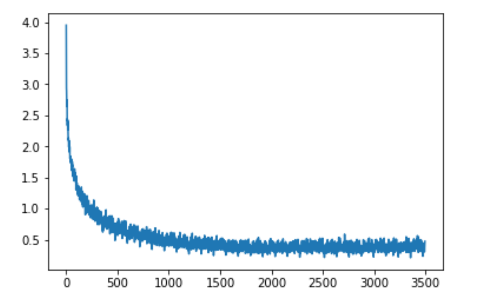
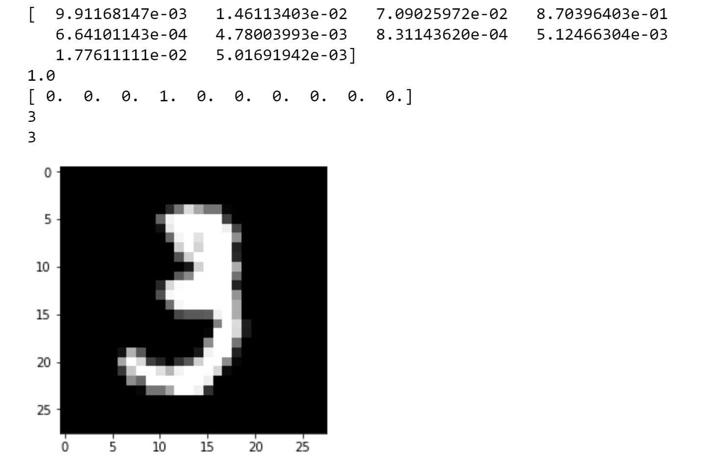

# Neural Network From Scratch

Building a Neural Network from zero without a framework like TensorFlow or Pytorch - Originally developed 25/01/2019

### You can just open the Jupyter Notebook and you will find everything there 

## What was developed in this project
A Neural Network from scratch without the help of a framework. This was an amazing experience, it was really powerful to face all the difficulties of building a neural network from scratch. You needed to really understand deeply the purpose of neural networks and how they actually work. 

## Results of the Project 

